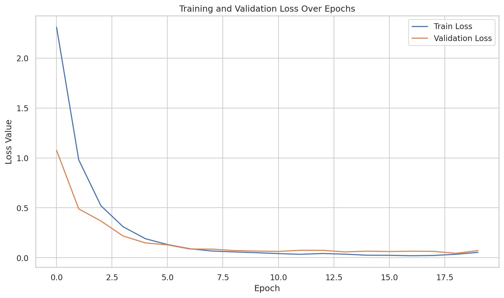
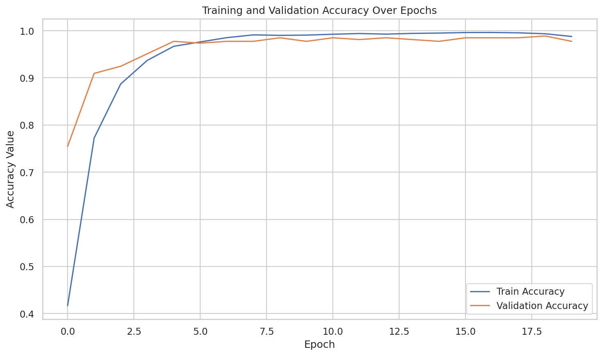
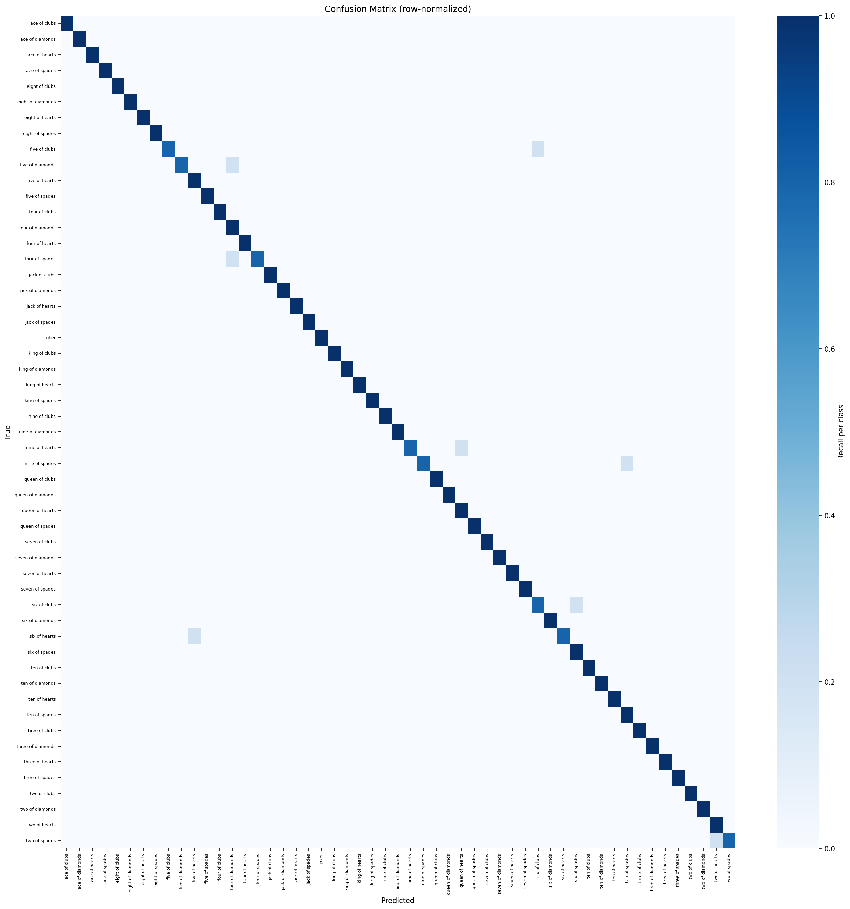

<div align="center">

# Playing Cards Image Classification

[](https://www.python.org)
[](https://pytorch.org/)
[](https://lightning.ai/)
[](https://developer.nvidia.com)

*A comprehensive evaluation of Convolutional Neural Networks for fine-grained image classification.*

</div>

## About The Project

This repository serves as an applied research project focused on **Fine-Grained Image Classification**. The goal is to accurately classify 53 categories of playing cards (52 standard deck cards + Joker) from images. 

Beyond simply solving the classification problem, this project was designed to be an educational deep-dive into the mechanics of deep learning. It systematically compares different CNN architectural paradigms, exploring the trade-offs between model complexity, inference speed, and accuracy, as well as the profound impact of Transfer Learning.

### Dataset
The project utilizes the excellent **[Cards Image Dataset Classification](https://www.kaggle.com/datasets/gpiosenka/cards-image-datasetclassification)** provided by *gpiosenka* on Kaggle. It contains highly diverse, cropped images of playing cards that provide a realistic challenge for computer vision models, especially for distinguishing between similar suits and numbers.

### Key Highlights
* **From-Scratch Engineering:** Implemented the classic **AlexNet** architecture entirely from scratch to build a solid foundation in CNN internals.
* **Transfer Learning Analysis:** Evaluated architectures (**ResNet-18** and **MobileNetV2**) in two distinct scenarios: training from scratch vs. fine-tuning with pre-trained ImageNet weights.
* **Rigorous Evaluation:** Generated comprehensive metrics including Accuracy, F1-Score per class, Confusion Matrices, and Precision/Recall curves to identify model biases and weaknesses.
* **Modern MLOps Stack:** Built with **PyTorch Lightning** for clean, decoupled, and highly scalable training loops, explicitly optimized for GPU acceleration.

---

## Results & Benchmarks

All models were evaluated using the same dataset splits and validation metrics. Training was accelerated using an **NVIDIA T4 GPU** provided via Lightning AI Studio.

| Architecture | Training Strategy | Accuracy | F1-Score | Parameter Scale | Observation |
|:---|:---|:---:|:---:|:---:|:---|
| **ResNet-18** | Transfer Learning | **97.0%** | **0.97** | Medium | Superior feature extraction, fastest convergence. |
| **MobileNetV2** | Transfer Learning | 94.3% | 0.94 | Lightweight | Best accuracy-to-compute ratio. Ideal for Edge/Mobile. |
| **ResNet-18** | From Scratch | 89.8% | 0.90 | Medium | Struggled with data scarcity compared to pre-trained version. |
| **AlexNet (Custom)** | From Scratch | 84.1% | 0.83 | Medium | Solid baseline; validated the custom network implementation. |
| **MobileNetV2** | From Scratch | 80.4% | 0.80 | Lightweight | Lacked the capacity to learn complex features quickly. |

---

## Visualizing Model Behavior
Below is a snapshot of the training dynamics and final evaluation for our best-performing model: **ResNet-18 (Pre-trained)**.

### Best Model Performance (ResNet-18 Transfer Learning)

<details>
<summary><b>Click to see exactly how well the model learned (Accuracy & Loss Curves)</b></summary>
<br>

Visualizing the training phase confirms how smoothly the pre-trained ResNet-18 model converged, without significant overfitting.

<div align="center">
  
  
</div>

</details>

<details>
<summary><b>Click to view the Confusion Matrix</b></summary>
<br>

A near-perfect diagonal across 53 classes proves the model isn't just randomly guessing or biased towards a specific suit.

<div align="center">
  
</div>

</details>


*(Note: Full resolution plots for all models (AlexNet, MobileNet, ResNet scripts) are available in the `reports/figures/` directory)*

---

## Tech Stack

* **Deep Learning:** PyTorch, PyTorch Lightning, Torchvision
* **Data Processing:** NumPy, Pandas, Scikit-learn
* **Visualization:** Matplotlib, Seaborn
* **Hardware:** NVIDIA T4 Tensor Core GPU

---

## Project Structure

```text
cards-image-cnn/
├── data/               # Contains train, valid, and test image splits
├── checkpoints/        # Saved model weights (.pt files)
├── reports/            # Generated metrics (.json) and evaluation plots
├── src/                # Model architectures and inner workings
│   ├── alexnet.py      # Custom implementation of AlexNet
│   ├── classifier.py   # LightningModule defining the training step
│   └── utils.py        # Data loading and metric logging utilities
├── config.py           # Hyperparameters and path configurations
├── train.py            # Main entry point for training pipelines
└── evaluate.py         # Script to run inference and gather test metrics
```

---

## Getting Started

### Prerequisites
Make sure you have Python 3.10+ installed. It is highly recommended to run this project in a virtual environment.

### Installation

1. Clone the repository:
   ```bash
   git clone https://github.com/yourusername/cards-image-cnn.git
   cd cards-image-cnn
   ```

2. Install the necessary dependencies:
   ```bash
   pip install -r requirements.txt
   ```

3. Download the [Cards Image Dataset](https://www.kaggle.com/datasets/gpiosenka/cards-image-datasetclassification) from Kaggle and extract it. Ensure your `data/` folder is correctly populated with the 53 class directories:
   ```
   data/
       train/
       valid/
       test/
   ```

### Usage

**To train a model:**
Modify `config.py` to select your desired architecture (`alexnet`, `resnet`, or `mobilenet`) and weights configuration, then run:
```bash
python train.py
```

**To evaluate a model and generate metrics:**
```bash
python evaluate.py
```
This will output `metrics.json`, `per_class_metrics.json`, and rendering plots (Confusion Matrix, Loss Curves, PR Curves) directly into the `reports/` folder.